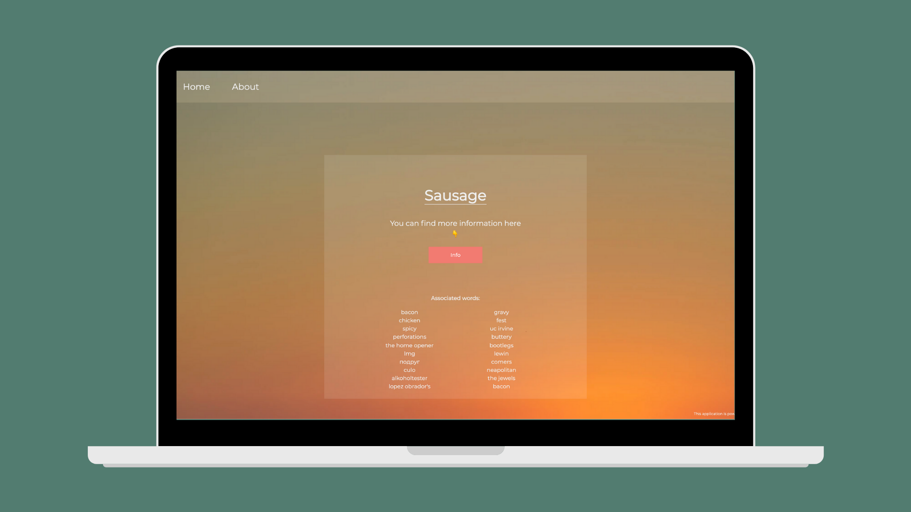

# Search-Word

`Search-Word` is an app powered by the [Gavagai API](https://developer.gavagai.io/#) where you can easily get more informations on any word, in any language, and have accessed to any of it's associated word. 
If you are interested in giving it go, you can access it with the URL below:
- http://search-associated-word.herokuapp.com/

## Getting-Started

Please follows this steps if you would like to start the project:

1) Clone the repo.
2) Create a [Gavagai](https://developer.gavagai.io/#) account to have your own API Key
3) ```cd client && npm install```
4) In the client repository create a ```.env``` file with this variable
```
VUE_APP_API_KEY=<Your API KEY>

```
5) ```npm run serve```

  Tada 🧙‍♀️ you're in !

## Screenshot

### Desktop Version
<div align="center">
  
</div>
<div align="center">
  
</div>


 ## Tech Stack
* [Vue](https://vuejs.org/)
* [Node.JS](https://nodejs.org/en/)
* [Express](https://expressjs.com/)
* [Gavagai API](https://developer.gavagai.io/#)


### Author

- Charles-Thibault Verrier - [GitHub](https://github.com/chthve) [Linkedin](https://linkedin.com/in/chthve)

## License

MIT © [chthve](https://github.com/chthve)